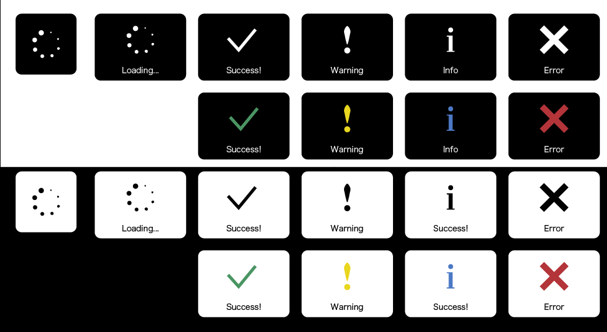

# KRProgressHUD

[](http://cocoapods.org/pods/KRProgressHUD)
[](http://cocoapods.org/pods/KRProgressHUD)
[](http://cocoapods.org/pods/KRProgressHUD)
[](https://github.com/Carthage/Carthage)

`KRProgressHUD` is a beautiful and easy-to-use progress HUD for your iOS written by Swift 2.

This library is inspired by [SVProgressHUD](https://github.com/SVProgressHUD/SVProgressHUD).

[KRActivityIndicatorView](https://github.com/krimpedance/KRActivityIndicator) is used for loading view.



## DEMO
To run the example project, clone the repo, and open `KRProgressHUDDemo.xcodeproj` from the DEMO directory.

or [appetize.io](https://appetize.io/app/nw022juw0znkf1n5u6ynga5ntm?device=iphone5s&scale=75&orientation=portrait&osVersion=9.2)

## Installation
KRProgressHUD is available through [CocoaPods](http://cocoapods.org) and [Carthage](https://github.com/Carthage/Carthage). 
To install it, simply add the following line to your Podfile:

```ruby:
# CocoaPods
pod "KRProgressHUD"
```

```ruby:
# Carthage
github "Krimpedance/KRProgressHUD"
```

## Usage
(see sample Xcode project in /Demo)

###### Caution :
**Only use it if you absolutely need to perform a task before taking the user forward.**

**If you want to use it with other cases (ex. pull to refresh), I suggest using [KRActivityIndicatorView](https://github.com/krimpedance/KRActivityIndicator).**

　　

`KRProgressHUD` is created as a singleton.

At first, import `KRProgressHUD` in your swift file.


Show simple HUD (using GCD) :
```Swift
KRProgressHUD.show()

let delay = dispatch_time(DISPATCH_TIME_NOW, Int64(1.0 * Double(NSEC_PER_SEC)))
dispatch_after(delay, dispatch_get_main_queue()) {
    KRProgressHUD.dismiss()
}
```

#### Showing the HUD
You can show HUD with some args.
You can appoint only the args which You want to appoint.
(Args is reflected only this time.)
```Swift
// progressHUDStyle : background color of progressView
// maskType : background color of maskView
// activityIndicatorStyle : style of KRActivityIndicatorView
// message : Text to display together
// image : Image that display instead of activity indicator
class func show(
    progressHUDStyle progressStyle :KRProgressHUDStyle? = nil,
    maskType type:KRProgressHUDMaskType? = nil,
    activityIndicatorStyle indicatorStyle :KRProgressHUDActivityIndicatorStyle? = nil,
    message :String? = nil,
    font :UIFont? = nil,
    image :UIImage? = nil
)

// Example
KRProgressHUD.show()
KRProgressHUD.show(message: "Loading...")
KRProgressHUD.show(progressHUDStyle: .Black, message: "Loading...")
...
```

#### Update the HUD's message
The HUD can update message.
```
class func updateLabel(text: String)

// Example
KRProgressHUD.updateLabel("20%")
```

#### Dismissing the HUD
The HUD can be dismissed using:
```
class func dismiss()
```
Show a confirmation glyph before getting dismissed a little bit later.
(The display time is 1 sec.)

These can appoint some args like `show()`, too.

```
class func showSuccess()
class func showInfo()
class func showWarning()
class func showError()
```

## Customization
`KRProgressHUD` can be customized via the following methods.
```
public class func setDefaultMaskType(type :KRProgressHUDMaskType)  // Default is .Black
public class func setDefaultStyle(style :KRProgressHUDStyle)  // Default is .White
public class func setDefaultActivityIndicatorStyle(style :KRProgressHUDActivityIndicatorStyle)  // Default is .Black
public class func setDefaultFont(font :UIFont)  // Default is Hiragino Sans W3 13px (When it can't be used, system font 13px)
```
`KRActivityIndicatorView`'s style, please refer to [here](https://github.com/krimpedance/KRActivityIndicator/blob/master/README.md).

## Contributing to this project
I'm seeking bug reports and feature requests.
(And please teach me if my English is wrong :| )

## Release Note
- 1.4.1 : Add Carthage. And, **fixed bug which HUD mask view isn't switched over**.
- 1.4.0 : Add the update function of message label.
- 1.3.0 : Corresponded to Landscape.
- 1.2.1 : Fixed bug(Don't display glyph color)
- 1.2.0 : Add document comments.

## License
KRProgressHUD is available under the MIT license. See the LICENSE file for more info.
